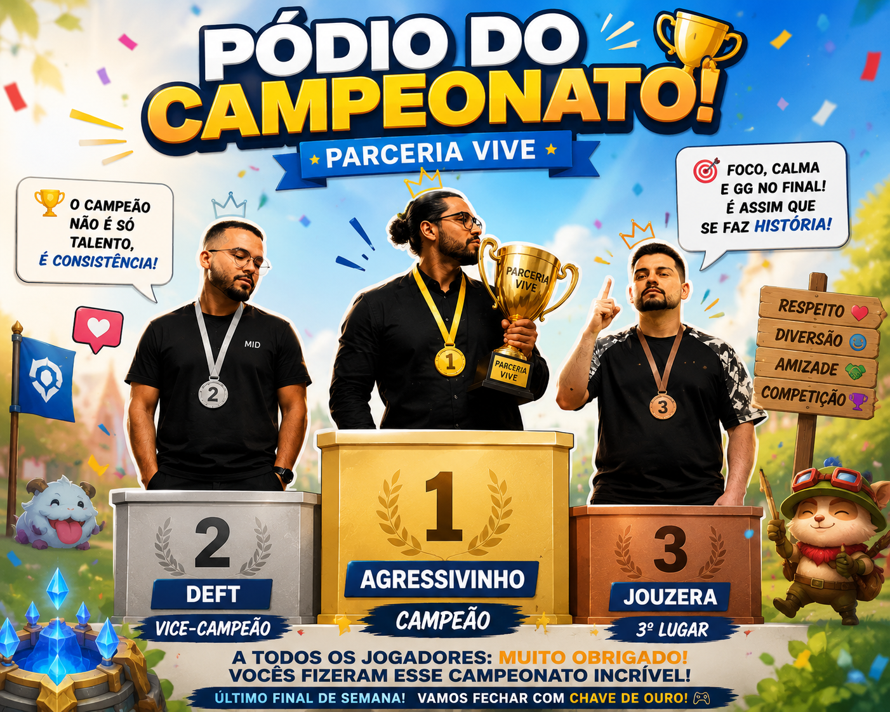

# 🏆 Campeonato Parceria Vive 2026

O **Campeonato Parceria Vive 2026** foi um campeonato de **League of Legends** organizado entre amigos e membros da comunidade com o objetivo de promover partidas equilibradas, competitividade e muita diversão ao longo de um mês inteiro.

Diferente de um torneio tradicional com eliminação, o campeonato foi disputado em formato de **fila ranqueada (In-House Queue)**. Os jogadores entravam na fila diariamente, e um sistema de matchmaking montava equipes de forma automática buscando equilibrar o MMR entre os dois times.

Cada participante acumulava ou perdia MMR de acordo com o resultado das partidas, formando um ranking dinâmico que foi atualizado durante todo o campeonato.

## 📅 Período

* **Início:** 30/05/2026
* **Encerramento:** 30/06/2026

## 🎯 Objetivo

O objetivo era simples:

* Criar partidas equilibradas entre jogadores da comunidade;
* Incentivar a participação constante;
* Premiar os jogadores mais consistentes durante todo o campeonato.

Ao final do evento, os **3 primeiros colocados** receberam troféus personalizados e premiação em dinheiro.

## ⚙️ Como funcionava

* Partidas 5x5 de League of Legends.
* Um jogador por rota (Top, Jungle, Mid, ADC e Suporte).
* Matchmaking baseado no MMR dos jogadores.
* Atualização do ranking após cada partida.
* O desempenho ao longo de todo o mês definia a classificação final.

## 📊 Estatísticas

Este projeto reúne todas as estatísticas geradas durante o campeonato, como:

* Ranking geral por MMR;
* Vitórias, derrotas e taxa de vitória;
* Evolução dos jogadores;
* Estatísticas individuais;
* Comparações entre participantes;
* Informações por posição (Top, Jungle, Mid, ADC e Suporte).

Todos os dados exibidos na página são gerados a partir dos arquivos JSON utilizados durante o campeonato, sem necessidade de banco de dados.

## 🛠️ Tecnologias

Este projeto foi desenvolvido utilizando apenas tecnologias web estáticas:

* HTML5
* CSS3
* JavaScript
* JSON

Todo o processamento das estatísticas acontece diretamente no navegador.

## ❤️ Agradecimentos

Este projeto só existiu graças à participação de toda a comunidade.

Independentemente da posição no ranking, cada jogador contribuiu para tornar o campeonato mais competitivo e divertido. Foram dezenas de partidas, muitas disputas equilibradas, viradas inesperadas e momentos marcantes que fizeram do **Parceria Vive 2026** uma experiência única.

Nos vemos na próxima edição! 🎮🏆

---

Observação: coloque a imagem enviada em assets/podio-campeonato.png para que o README a exiba corretamente.

